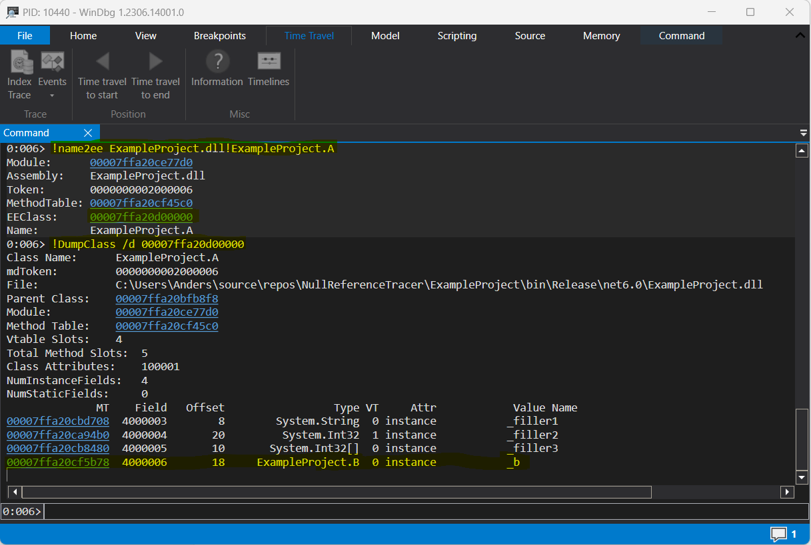

# Guide
If you run the ExampleProject from this solution in release mode you will get a NullReferenceException similar to this:
```
System.NullReferenceException: Object reference not set to an instance of an object.
at ExampleProject.A.Run(Boolean throwNullReferenceException) in C:\x\NullReferenceTracer\ExampleProject\A.cs:line 33
at Program.<Main>$(String[] args) in C:\x\NullReferenceTracer\ExampleProject\Program.cs:line 15
```
According to the stack trace the exception is happening on line 33 in the `ExampleProject.A.Run` method, however if we 
look in the source we can see that that is impossible, and the exception is actually thrown in the method called on line 33, 
`ExampleProject.B.AccessNullField`. Due to the bare-bones nature of the example this is not a very hard "impossible" 
NullReferenceException to debug, but it will serve as an example for this guide.

## Getting the assembly code

Run NullReferenceTracer with administrator privileges to start tracing NullReferenceExceptions, then start ExampleProject 
from a release build. You should get output similar to this:
```
Got NullReferenceException in process. PID=35700
ExampleProject.A.Run(Boolean)
00007FFA2AC592E0 push      r14
00007FFA2AC592E2 push      rdi
00007FFA2AC592E3 push      rsi
00007FFA2AC592E4 push      rbp
00007FFA2AC592E5 push      rbx
00007FFA2AC592E6 sub       rsp,20h
00007FFA2AC592EA mov       rsi,rcx
00007FFA2AC592ED movzx     edi,dl
00007FFA2AC592F1 test      edi,edi
00007FFA2AC592F3 je        short 0000`7FFA`2AC5`92FBh
00007FFA2AC592F5 add       dword [rsi+20h],3
00007FFA2AC592F9 jmp       short 0000`7FFA`2AC5`92FFh
00007FFA2AC592FB add       dword [rsi+20h],5
00007FFA2AC592FF mov       rbx,[rsi+10h]
00007FFA2AC59303 xor       ebp,ebp
00007FFA2AC59305 mov       r14d,[rbx+8]
00007FFA2AC59309 test      r14d,r14d
00007FFA2AC5930C jle       short 0000`7FFA`2AC5`9321h
00007FFA2AC5930E movsxd    rcx,ebp
00007FFA2AC59311 mov       ecx,[rbx+rcx*4+10h]
00007FFA2AC59315 call      0000`7FFA`2AC5`9100h
00007FFA2AC5931A inc       ebp
00007FFA2AC5931C cmp       r14d,ebp
00007FFA2AC5931F jg        short 0000`7FFA`2AC5`930Eh
00007FFA2AC59321 test      edi,edi
00007FFA2AC59323 je        short 0000`7FFA`2AC5`9335h
00007FFA2AC59325 mov       rcx,[rsi+18h]
00007FFA2AC59329 mov       rcx,[rcx+8]
* 00007FFA2AC5932D mov       ecx,[rcx+10h]
00007FFA2AC59330 call      0000`7FFA`2AC5`9100h
00007FFA2AC59335 mov       eax,[rsi+20h]
00007FFA2AC59338 add       rsp,20h
00007FFA2AC5933C pop       rbx
00007FFA2AC5933D pop       rbp
00007FFA2AC5933E pop       rsi
00007FFA2AC5933F pop       rdi
00007FFA2AC59340 pop       r14
00007FFA2AC59342 ret
00007FFA2AC59343 add       [rcx],bl
00007FFA2AC59345 or        al,[rsi]
00007FFA2AC59347 add       [rdx],cl
00007FFA2AC59349 xor       al,[rsi]
00007FFA2AC5934B xor       [rel 7FFA`2E25`97A1h],al
00007FFA2AC59351 jo        short 0000`7FFA`2AC5`9355h
00007FFA2AC59353 loopne    0000`7FFA`2AC5`9355h
00007FFA2AC59355 add       [rax],al
00007FFA2AC59357 add       [rdx],al
```

The exception is cause by this line, `* 00007FFA2AC5932D mov       ecx,[rcx+10h]`, where we try to read from memory location 
`RCX + 0x10` and store it in register `ECX`. So the value of `RCX` is probably 0x0. Now we just need to figure out where
it is getting this value from.

## Eliminating branches

Next we need to find a execution path from the start of the method to where the exception occurs, so when we see a jump 
instruction (`JMP`, `JE`, `JG`, `JLE`, etc.) we need to decide whether to jump or not. Ideally we just want to find the
shortest path possible, but any path will do. If you are having a hard time with the control flow you can try to replace
the addresses with labels or you can draw arrows to illustrate the control flow. After removing branches the remaining
assembly code should look something like this:

```
ExampleProject.A.Run(Boolean)
00007FFA2AC592E0 push      r14
00007FFA2AC592E2 push      rdi
00007FFA2AC592E3 push      rsi
00007FFA2AC592E4 push      rbp
00007FFA2AC592E5 push      rbx
00007FFA2AC592E6 sub       rsp,20h
00007FFA2AC592EA mov       rsi,rcx
00007FFA2AC592ED movzx     edi,dl
00007FFA2AC592F1 test      edi,edi
00007FFA2AC592F3 je        short 0000`7FFA`2AC5`92FBh
00007FFA2AC592FB add       dword [rsi+20h],5
00007FFA2AC592FF mov       rbx,[rsi+10h]
00007FFA2AC59303 xor       ebp,ebp
00007FFA2AC59305 mov       r14d,[rbx+8]
00007FFA2AC59309 test      r14d,r14d
00007FFA2AC5930C jle       short 0000`7FFA`2AC5`9321h
00007FFA2AC59321 test      edi,edi
00007FFA2AC59323 je        short 0000`7FFA`2AC5`9335h
00007FFA2AC59325 mov       rcx,[rsi+18h]
00007FFA2AC59329 mov       rcx,[rcx+8]
* 00007FFA2AC5932D mov       ecx,[rcx+10h]
```

## Backtracking the null value

Next we need to backtrack the null value. In the last line register `RCX` contains 0x0, but where did it get that value 
from? If we look at the line above we can see that it sets `RCX` to the value at memory location `RCX + 0x8`. So next question
is, where did that `RCX` value come from?

If we continue like that and eliminate all instructions the doesn't affect the final value of `RCX` then we end up with
this assembly code:
```
ExampleProject.A.Run(Boolean)
00007FFA2AC592EA mov       rsi,rcx
00007FFA2AC59325 mov       rcx,[rsi+18h]
00007FFA2AC59329 mov       rcx,[rcx+8]
* 00007FFA2AC5932D mov       ecx,[rcx+10h]
```

## Finding the source of the null object

Now we just need to figure out what each of these registers are pointing to. To figure out what `RCX` contains at the 
beginning of the method we take a look at [Windows x64 calling convention](https://learn.microsoft.com/en-us/cpp/build/x64-calling-convention?view=msvc-170).
We see that `RCX` is used to pass the first integer parameter. For instance methods the first integer parameter is always
`this` (a reference is just an integer that is interpreted as a memory address). So in the first line we are setting `RSI`
to `this`.

What about the next line? What is located at memory offset 0x18 in ExampleProject.A classes? One way to figure this out is to start a new
instance of ExampleProject and attach [WinDbg](https://apps.microsoft.com/store/detail/windbg-preview/9PGJGD53TN86) to the process. Then we can use [SOS](https://learn.microsoft.com/en-us/dotnet/framework/tools/sos-dll-sos-debugging-extension)
to figure out the memory offset 0x18 contains the `_b` field of type `ExampleProject.B`:


So if we continue with this we get:
```
ExampleProject.A.Run(Boolean)
00007FFA2AC592EA mov       rsi,rcx         ; this (ExampleProject.A)
00007FFA2AC59325 mov       rcx,[rsi+18h]   ; this._b (ExampleProject.B)
00007FFA2AC59329 mov       rcx,[rcx+8]     ; this._b._nullObject (ExampleProject.C)
* 00007FFA2AC5932D mov       ecx,[rcx+10h] ; this._b._nullObject.<Value>k__BackingField (Int32)
```

This ends the investigation. Now we know exactly why we are getting a `NullReferenceException`.

## Advanced examples

The example project is a bit simple. It doesn't depend on objects from arrays, objects returned from (non-inlined) method 
calls or objects that are passed along using the stack. To get some experience with these you can try to play around with the 
ExampleProject. Consult the [Windows x64 calling convention](https://learn.microsoft.com/en-us/cpp/build/x64-calling-convention?view=msvc-170) to see how objects are passed along in different scenarios.